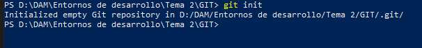
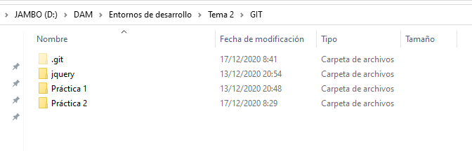
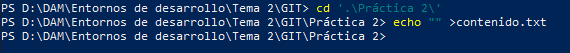
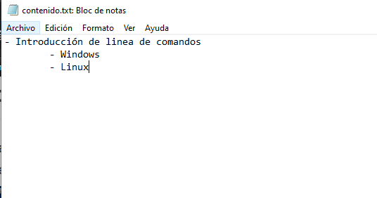
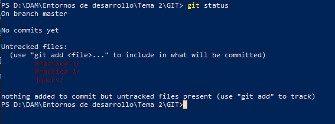

# Práctica 2 - GIT

#### 1. Crea un repositorio (directorio) llamado practica2git e inicia el sistema de control de versiones.

#### 2. Crea un fichero llamado contenido.txt con el siguiente texto:

- Introducción de linea de comandos
    - Windows
    - Linux
    

#### 3. Comprueba el estado del repositorio.

####  4. Añade el fichero a la zona de preparado.

