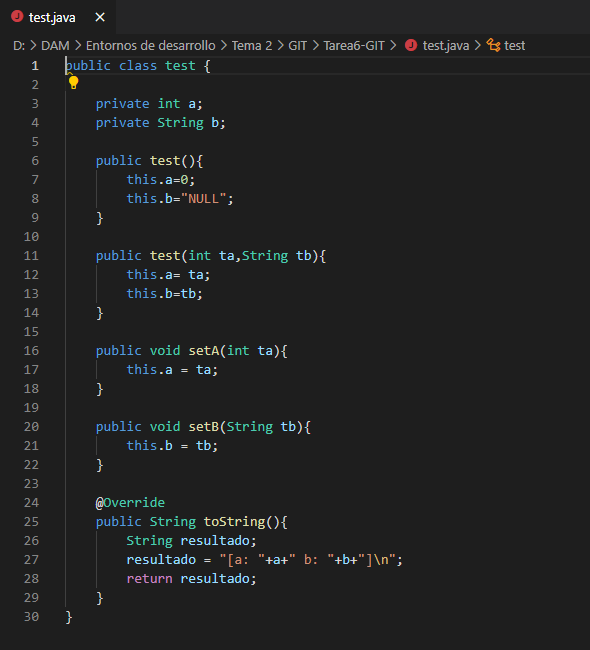
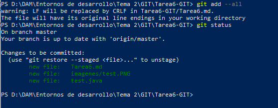
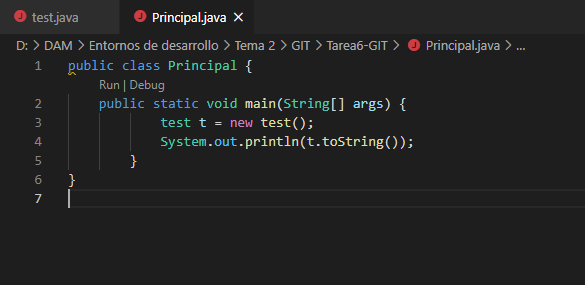
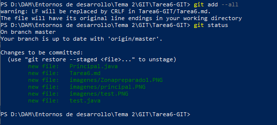
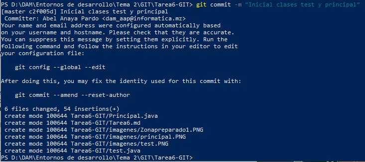

# Tarea 6. Repaso GIT. Métdo Tostring en Java.

#### 1. Cread un fichero test.java con la clase test como sigue:

#### 2. Pasad a preparado el fichero.

#### 3. Cread el fichero Principal.java.

#### 4. Pasad a preparado el fichero.

#### 5. Haced un commit con el comentario "Inicial clases test y principal".

#### 6. Comprobar la salida del programa (debéis compilar los .java y probar el Principal).

